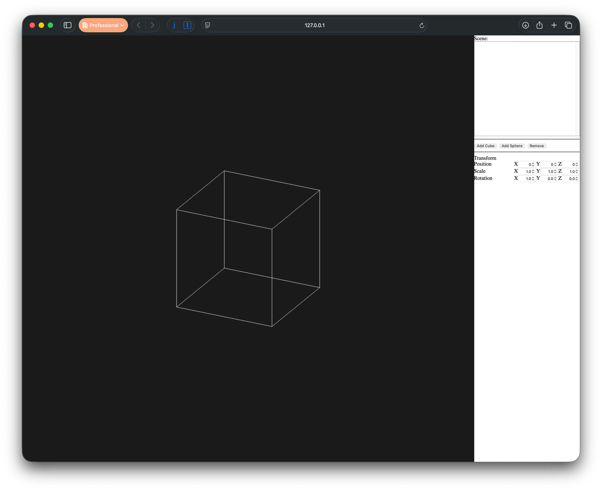

# Aula Prática 4 - Instanciação de Primitivas

## Introdução

Nesta sessão vamos desenvolver uma pequena aplicação que permite visualizar uma cena definida por instanciação de objetos primitivos, aos quais estará associada uma transformação de instanciação própria.

O utilizador pode adicionar à cena, cuja estrutura é linear (uma lista simples de objetos) um objecto escolhido de entre um conjunto de objetos primitivos disponíveis.

O esqueleto da aplicação é fornecido e pode ser obtido no [repositório](https://gitlab.com/CGI-Code/cgi-25-26) que temos vindo a utilizar.

Se reparar, quando a aplicação é lançada apenas visualizamos um cubo, o qual não sofre qualquer alteração pois a interface da aplicação não está, de momento, a fazer nada de útil.

Leia o código da aplicação [app.js](../../src/labs/ex12-step0/app.js) e identifique o local onde o objeto é desenhado. Vai reparar que a função usada para desenhar o objeto primitivo faz parte dum dos módulos javascript fornecidos com o exemplo. Dê uma vista de olhos no ficheiro [libs/objects/cube.js](../../src/libs/objects/cube.js) e [libs/objects/sphere.js](../../src/libs/objects/sphere.js). Repare nas funções que são exportadas pelos módulos, o que elas fazem, e onde estão a ser invocadas no script [app.js](../../src/labs/ex12-step0/app.js).

O lado direito da interface está organizado da seguinte forma:

- Topo: uma lista que conterá o nome de cada um dos objetos que constituem a cena visualizada no lado esquerdo da janela
- Uma secção, com botões, onde se podem acrescentar novos objetos primitivos ou apagar um objeto da cena
- Uma secção onde se mostram as propriedades do objeto selecionado (activo)

## ex12 - Adicionar objectos à cena

Modifique a aplicação dada de modo a podermos acrescentar um cubo ou uma esfera à lista de objetos em cena premindo o botão apropriado. O nome do objeto a colocar na lista pode ser gerado automaticamente, mas convém ser distinto para cada instância. Consulte a documentação dos objetos do tipo HTMLSelectElement, com especial atenção ao método add().

Para tal terá que realizar as seguintes alterações:

- Programe os event handlers dos botões "Add Cube" e "Add Sphere". Em cada um destes botões deverá registar na sua aplicação (usando um ou mais vetores) que possui mais uma instância dum objeto primitivo. Para já bastará registar qual das primitivas foi criada, mas mais tarde isto terá que ser alterado.
- Modifique a função que redesenha o canvas para percorrer a informação que se encontra armazenada no vetor das instâncias e desenhe o objeto correspondente. Repare que para desenhar um objeto, o vertex shader fornecido espera que lhe seja fornecida uma matriz de 4x4 (u_ctm) que representa a matriz de transformação corrente dessa instância. Esta matriz corresponde ao produto de 3 matrizes:

    `mProjection * mView * mModel`. 

    As duas primeiras matrizes já se encontram inicializadas e não necessita alterar os seus valores. A última matriz é a que corresponde à transformação de modelação da instância que está a ser desenhada. Para começar pode assumir que é, para já, a matriz identidade. No exercício seguinte isto irá ser modificado.

## ex13 - Edição da transformação do último objeto inserido

No exercício ex12 chegámos a um ponto onde podemos acrescentar cubos e esferas à nossa cena, mas apenas conseguimos distinguir no máximo 2 objetos - um cubo e uma esfera - mesmo que se tenham criados vários de cada tipo.

O que se passa é que os diversos cubos que possam ter sido criados não se conseguem distinguir uns dos outros, o mesmo sucedendo às várias esferas que possam ter sido criadas.

Para resolver este problema vamos associar a cada instância uma transformação geométrica de instanciação que nos permitirá escalar, orientar e posicionar os objetos em cena e assim distinguir as diversas instâncias.

Para já vamos apenas fazer com que a interface disponibilizada afete apenas a última instância criada. Assim, caso a cena esteja vazia, os respetivos elementos da interface deverão estar inactivos. Quando se adicionar uma instância, qualquer alteração nesses elementos da interface deverão produzir uma alteração na transformação mModel específica dessa instância, de modo a que, ao desenhar-se a cena, possamos ver o objecto com a respetiva transformação aplicada.

A matriz mModel da instância que está a ser manipulada corresponde à seguinte composição:

    mModel = T(px, py, pz) Rz(rz) Ry(ry) Rx(rx) S(sx, sy, sz)

Os valores dos parâmetros destas transformações são os presentes na interface.

Para resolver este exercício deverá:

- Programar os eventos "change" dos elementos da interface e atualizar a matriz mModel da última instância.
- Acrescentar ao vetor das instâncias a transformação mModel respectiva

## ex14 - Remoção de instâncias

Programe o evento do botão "Remove" que deverá remover a instância que se encontra selecionada na lista. Ao apagar essa instância, a anterior deverá passar a estar selecionada.

## ex15 - Edição da transformação de qualquer objeto da cena

Modifique a aplicação por forma a poder selecionar qualquer instância da lista e passar assim a poder editar a transformação de modelação dessa instância.

Para poder executar esta tarefa precisa num primeiro passo de recuperar os parâmetros que a colocar nas caixas da interface. Isto é impossível se apenas tiver guardado a matriz mModel de cada instância. Pense numa solução e implemente-a.

## ex16 - Ordem de aplicação das transformações
Experimente alterar a ordem de aplicação das transformações, testando as seguintes (por esta ordem de aplicação):

- 1º Rotações, 2º Escala, 3º Translação
- 1º Rotação, 2º Translação, 3º Escala
- 1º Translação, 2º Escala, 3º Rotações
- 1º Translação, 2º Rotações, 3º Escala

## ex17 - Primitivas adicionais

Acrescente as seguintes primitivas à sua aplicação:

- cilindro
- torus
- pirâmide

Não se esqueça de acrescentar os respetivos botões.

