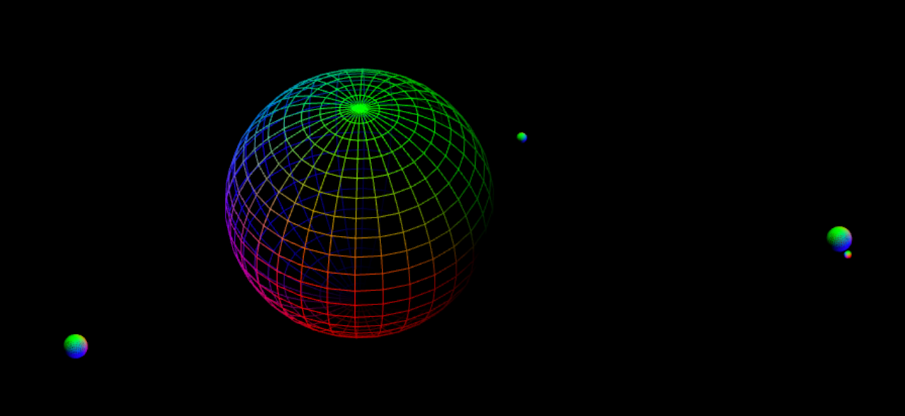
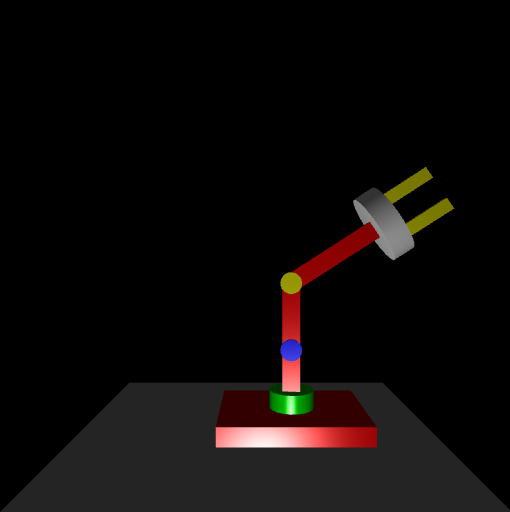

# Aula Prática 5 - Modelação Hierárquica

## Introdução

O sistema solar é um espaço essencialmente vazio. Se o modelássemos à escala, os corpos celestes que o compõem seriam demasiado pequenos e estariam demasiado afastados para que a cena se pudesse visualizar no seu conjunto. Como alternativa propomos alterar as dimensões da seguinte forma:

- Todos os corpos celestes são ampliados por um fator (por exemplo 10)
- Todas as órbitas (com exceção da órbita da Lua em torno da Terra) são reduzidas por um fator (por exemplo 60).
As constantes usadas na simulação podem ser (quase todas) consultadas [aqui](http://www.exploratorium.edu/ronh/solar_system/).

A aplicação deverá permitir a animação do Sol e dos planetas modelados, podendo o utilizador acelerar, retardar e até mesmo parar a evolução do tempo.

## Preparação

Use os ficheiros disponíveis no repositório para iniciar o exercício. Examine as constantes relativas às dimensões e durações das órbitas e dos dias de cada astro.

Comece por desenhar o grafo de cena correspondente ao Sol (no papel), incluindo a sua rotação. Use uma variável `time` no seu grafo para representar o tempo da simulação (em dias).

# ex18 - Sol

Escreva uma função `Sun()` no seu programa contendo o código resultante da tradução do seu grafo que resultou do passo anterior. Invoque a função que acabou de escrever a partir da sua função `render()`.

## ex19 - Sol, Mercúrio e Vénus

Acrescente ao seu grafo (no papel) o planeta Mercúrio e o planeta Vénus, incluindo as suas rotações em torno dos eixos próprios e os movimentos de translação em torno do Sol. Para simplificar vamos assumir que os eixos de rotação de todos os planetas estão alinhados com o eixo Y do mundo.

Acrescente no seu código as funções que desenham (na origem) cada um dos planetas em questão: Mercúrio e Vénus. De seguida invoque as funções novas, bem como a função anterior (`Sun()`) a parir da sua função `render()`.

## ex20 - Terra e Lua

Construa um grafo de cena novo, respeitante apenas ao par Terra-Lua, incluindo o movimento de rotação da Terra (a qual deverá ter o seu eixo alinhado com Y e estar centrada na origem) bem como o movimento de translação da Lua em torno da Terra.

Construa duas funções `Earth()` e `Moon()`, bem como uma função `EarthAndMoon()` que as use e que permita visualizar o conjunto.

## ex21 - Visualização desde o Sol até à Lua

Acrescente ao seu grafo do sistema solar o sub-grafo do par Terra-Lua. 

Incorpore tudo no seu programa.

**Nota**: Não se esqueça de estabelecer limites adequados para o volume de visão, à media que vai aumentando a abrangência do seu sistema solar. Provavelmente terá que modificar o raio da órbita lunar para que esta seja desenhada sem estar a colidir com a Terra.

## ex22 - Sistema Solar completo

Acrescente os restantes planetas dos sistema solar. Veja o que acontece se modelar o sistema à escala.

## ex23 - Modelação do braço de um robot

Construa o grafo de cena correspondente a um braço de robot, semelhante ao da figura. Cabe-lhe a si definir as medidas de cada elemento, bem como as variações adequadas (limites) dos parâmetros do grafo que conferem os graus de liberdade ao modelo.

Escreva o programa que implementa o grafo de cena, oferecendo ao utilizador o controlo necessário para a manipulação do modelo (variação dos parâmetros). Não se preocupe com a iluminação.