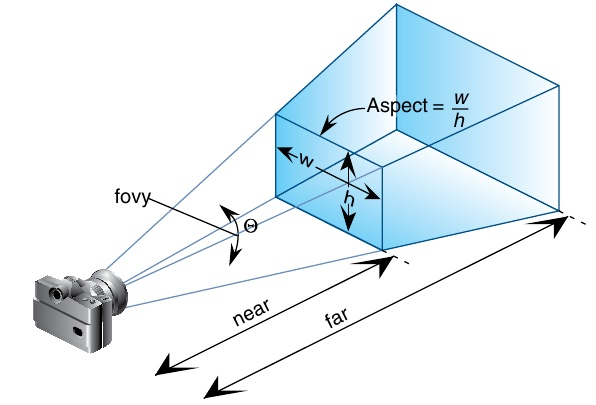
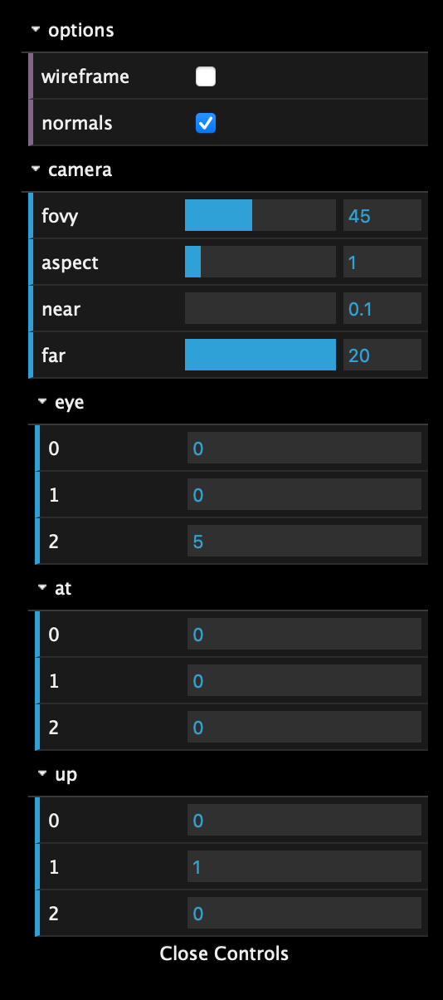
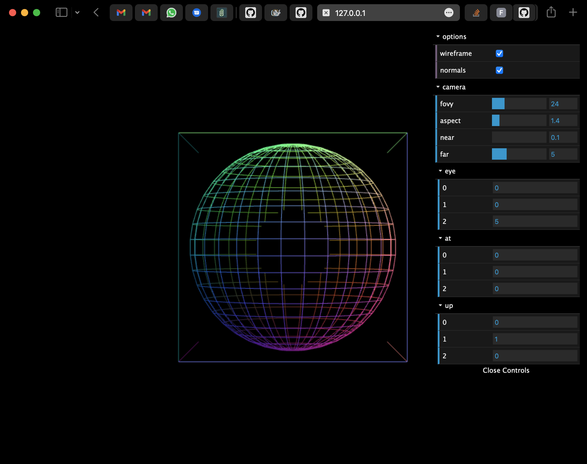
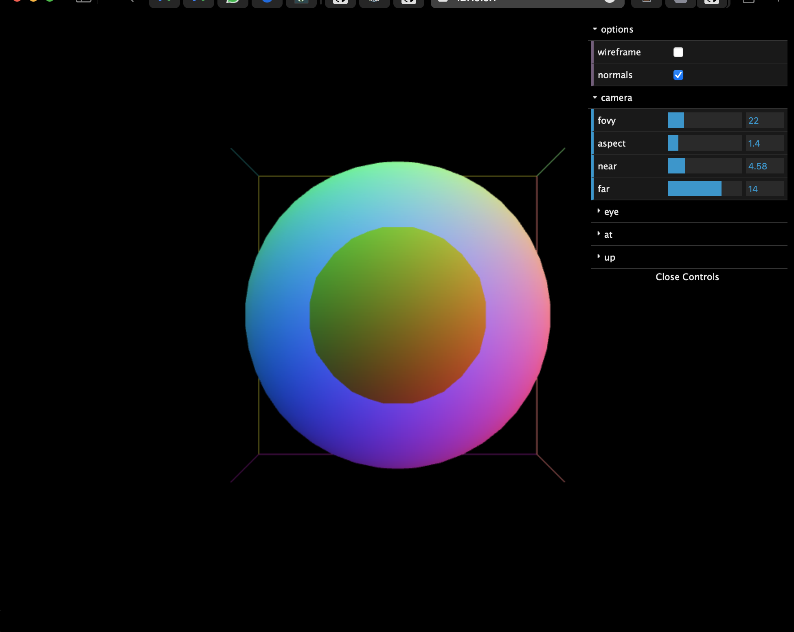
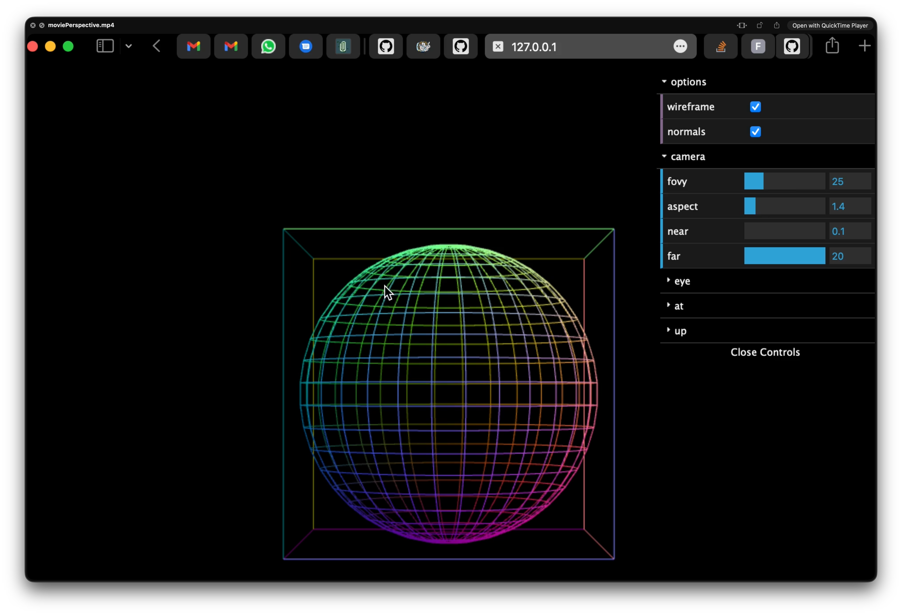

# Aula Prática 8 - Projeção Perspetiva

## Introdução

A projeção perspectiva, com o volume de visão centrado no eixo Z (no referencial da câmara), pode ser definida a partir dos seguintes parâmetros:

- fovy - ângulo que representa o campo de visão vertical
aspect - a relação entre a largura e a altura do volume de visão
- near - distância (para a frente da câmara) a que se encontra o plano de recorte anterior
- far - distância (para a frente da câmara) a que se encontra o plano de recorte posterior

A biblioteca [MV.js](../../src/libs/MV.js) disponibiliza a função:

[perspective(fovy, aspect, near, far)](../../src/libs/MV.js#L506)

a qual devolve a matriz de projeção. Esta matriz transforma o volume de visão especificado, no volume canónico de recorte (clip space) [-1,1]x[-1,1]x[-1,1].

Nesta série de exercícios pretende-se desenvolver uma aplicação que permite ao utilizador controlar os parâmetros da câmara (posição e orientação) e da projeção perspectiva (anteriormente mencionados).

A cena é constituída por uma esfera e um cubo sem qualquer transformação de modelação a eles aplicada. A esfera poderá ser visualizada em malha de arame (wireframe) ou com a superfície preenchida, sendo o cubo visualizado sempre em malha de arame. A cor deverá ser uma cor sólida ou o mapeamento para RGB das normais.

## ex24

Construa a interface que permitirá controlar os parâmetros da projecção, bem como as opções de visualização, usando para isso a biblioteca [dat.gui]. A biblioteca encontra-se no [repositório de CGI](../../src/libs/dat.gui.module.js), mas aconselha-se a consulta do [repositório oficial](https://github.com/dataarts/dat.gui).

A interface deverá ser semelhante a esta:

A aplicação deverá já permitir a visualização dos objetos, embora a câmara esteja ainda fixa. Use os seguintes valores iniciais:

- eye = (0,0,5)
- at = (0,0,0)
- up=(0,1,0)
- fovy = 45
- aspect (o determinado pela relação de aspeto da janela do browser)
- near = 0.1
- far = 20

Atenção que `far` deverá ser sempre superior a `near`. Os parâmetros `fovy`, `near` e `far` poderão ser manipulados directamente nos controladores disponibilizados pela interface. O valor de `aspect` deverá estar sempre trancado e deverá ser igual à relação de aspecto da janela do browser.

Os parâmetros `eye`, `at` e `up` não deverão ser manipulados na interface, embora se possa ali visualizar os seus valores.

A interface deverá permitir a escolha do modo de visualização (wireframe/preenchido) e se o shader irá desenhar os objetos com uma cor sólida ou com mapeamento das normais para a cor.

Use como ponto de partida o código disponibilizado em [ex24-step0](../../src/labs/ex24-step0).

## ex25

Torne a sua aplicação reactiva às alterações dos parâmetros `near`, `far`, e `fovy`. Este último poderá também ser controlado usando o evento "wheel" sobre o canvas. A interace deverá mostrar o valor de fovy sempre atualizado, mesmo que este seja alterado através do evento "wheel", em vez de manipular diretamente o slider da interface gráfica.

Faça com que a aplicação reaja às opções de visualização (wireframe/preenchido) e utilização das normais na cor das primitvas.

Eis dois exemplos de em diferentes momentos de utilização da aplicação:

No primeiro exemplo, a esfera é desenhada em malha de arame e o plano de recorte de trás está a recortar os objetos, enquanto que no segundo exemplo é o plano de recorte da frente que está a recortar os objectos, sendo a esfera desenhada em modo de preechimento.

## ex26

A aplicação deverá agora permitir ao utilizador a manipulação dos parâmetros `eye` e `at`, da seguinte maneira:

No evento "wheel", se estiver a ser premida uma tecla modificadora (por exemplo CTRL), então o valor de `eye` deverá aproximar-se/afastar-se de `at`, consoante o evento "wheel" informa que a roda se deslocou numa direção ou na outra.
No evento "wheel", se estiver a ser premida outra tecla modificadora (por exemplo o ALT), então quer `eye`, quer `at` deverão andar para a frente (em relação à câmara) ou para trás, consoante a direção dada pelo evento "wheel". A distância entre `eye` e `at` permanece inalterada.

Observa alguma diferença entre as duas abordagens anteriores?

## ex27

Altere a sua aplicação por forma a que, ao clicar no canvas e arrastar o rato, a câmara possa girar, mantendo a atenção no mesmo ponto, de acordo com o movimento que o utilizador faz com o rato.

Fica aqui um pequeno video demonstrativo da aplicação.As secções do vídeo com o fundo a vermelho correspondem aos momentos em que esta funcionalidade foi usada.

