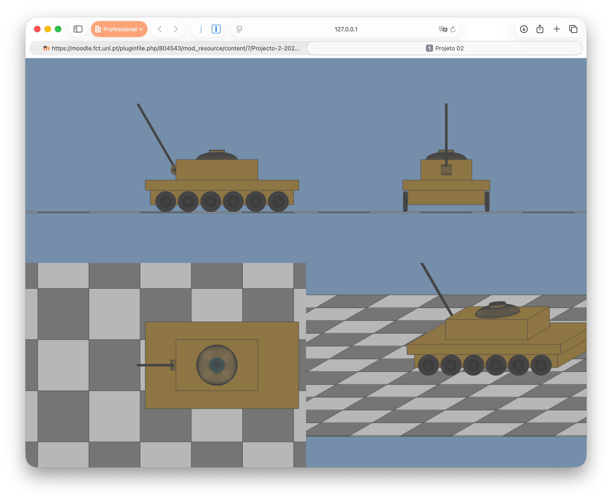

# Project 2 - 3D Hierarchical Modelling and Projections
Version Draft 0.9

## Change log:

- 27/10/2025 18h30, Draft 0.9 version published.

## Objective

Develop a WebGL application that allow the manipulation of a tank to be used to fire tomatoes. This tank is a top secret project for the next [Tomatina](https://en.wikipedia.org/wiki/La_Tomatina) event.

The tank should be similar to the one depicted in the following figures.

|  |  |
|-----------|-----------|
|  | |
| Front View| Left View|
|  | |
| Top View| Oblique View|

The control of the application should mostly be performed via the keyboard. The following figures shows the controls required:

These controls are divided into the following groups:

- Controlling the tank model ('q', 'w', 'e', 'a', 's', 'd')
- Choosing the projection for single view ('1', '2', '3', '4')
- Toggle between single view of multiple views ('0')
- Toggle between axonometric and oblique projections in the fourth quadrant ('8')
- Toggle between parallel and perspective view volumes ('9')
- Controlling the Oblique or Axonometric parameters ('Up', 'Down', 'Left', 'Right' cursor keys)
- Switching between wireframe and solid drawing (' ') and reset porjection paramaters ('r').
- Reseting the zoom level and the fourth view parameters ('r')

The image below shows the output of the application in multiple views mode, by using the European method of layout.

Additionally the user should be able to zoom in and zoom out in all the views using the mouse wheel, while keeping the views centered on the same point. The tank should be completely visible.

Apart from the tank, a ground plane should be drawn with its top surface at y=0, by using a tiled chequered pattern of cube primitives.

## Tank model

The tank model should display a hierarchy of elements that aggregate its different parts. The tank is of free design and dimensions, although it must contain the following elements:
- A cabin that can be rotated in both directions (commands 'a' and 's')
- A cannon, attached to the cabin that can be rotated up and down (commands 'w' and 's')
- The tank must consist of a cabin and a base.
- The tank base should have 12 wheels, which can turn depending on the movement applied to the
tank (commands ‘q’ and ‘e’)
- In total, the tank should have a minimum of 10 primitives. The example shown contains many more...

There are two options for implementing the tank design (this does not apply to the floor design):

1. After drawing/building the scene graph on paper, generate the corresponding code, as done in the labs and in the examples from the lectures.
2. After drawing/constructing the graph on paper, create a JavaScript object, in a tree like structure, that represents that same graph and implement a function capable of scanning it and drawing the primitives. You can also load a JSON file and use it to create your tree like structure for the scene. It is also advisable to allow the existence of sub-graphs when loading data from a JSON file.

For option 2, the following types of nodes should be considered:
a) internal branch/node with transformations and descendants.
b) terminal branch/node with transformations and a primitive.

The organization of the transformations in a node will need adhere to the following convention:

- Each node always stores a scale, 3 rotations around the principal axis and a translation.
- The local node transformations are applied by using the following order (for a generic point P multiplied on the right): T . Rz . Ry . Rx . S . P

The graph must have a branch/node of type a) at its root. In this option, you should consider the possibility that the branches/nodes have a name, thus enabling the writing of a function that, given the name of the branch/node, returns the reference to the respective object. Thus, it will be possible to easily implement event handlers that will change the parameters of the graph transformations.

The floor plan can be drawn without a memory representation of the respective graph, by writing the code directly, as was done in the exercises from the labs. Alternatively you can write functions that add nodes to your graph and dynamically insert the floor plan nodes.

## Technical information

## Evaluation

