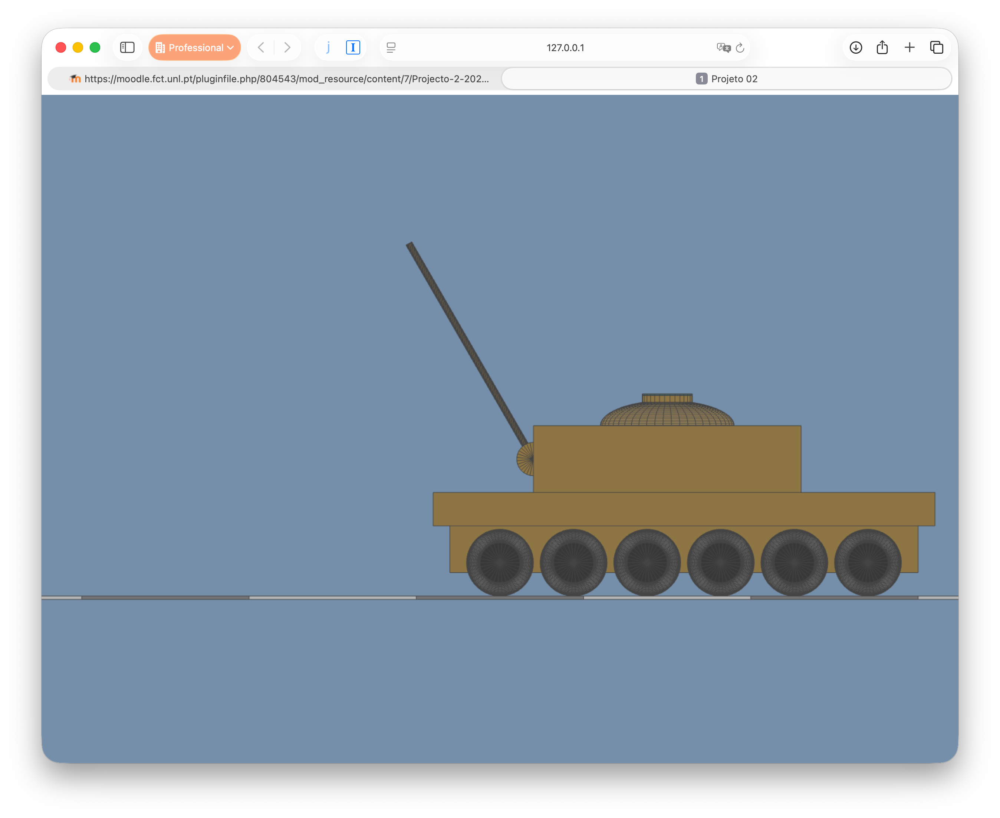
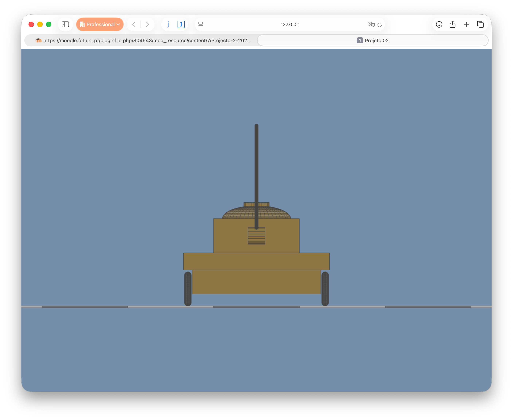
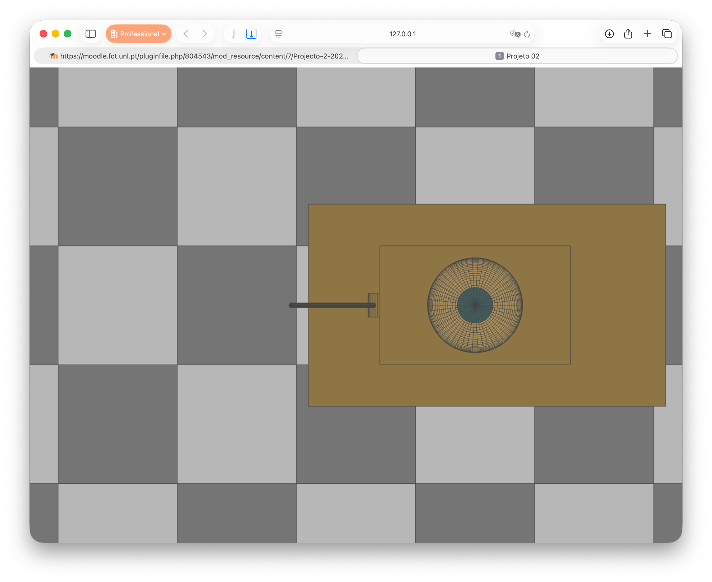
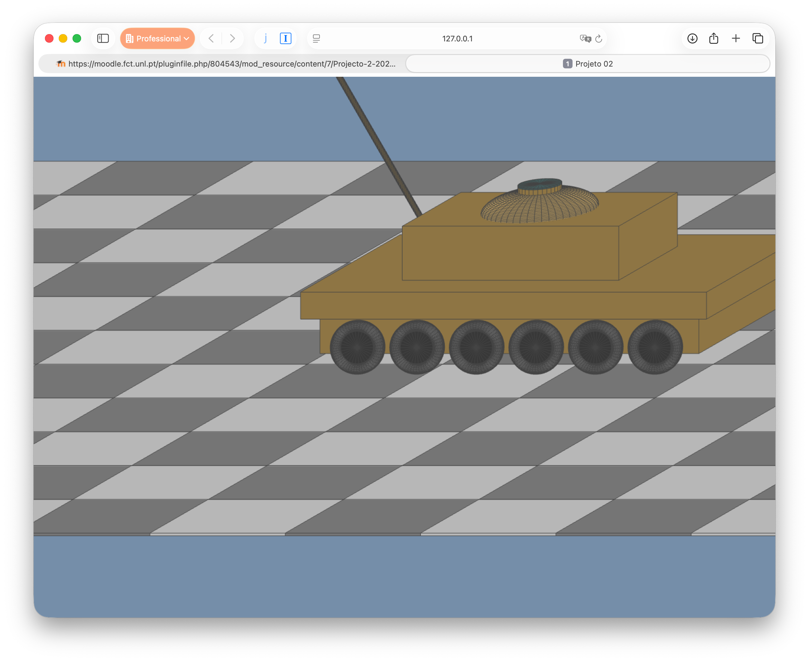
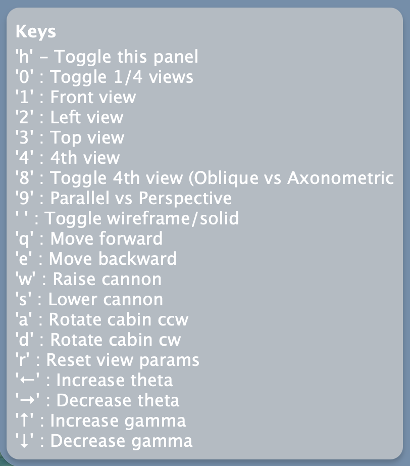

# Project 2 — 3D Hierarchical Modelling & Projections
**Version Draft 0.92 — Student-Friendly Edition**

## Change Log
- 28/10/2025 — Draft 0.92 published (student-friendly + checklist)
- 28/10/2025 1h00, version 0.91 published.
- 27/10/2025 18h30, Draft 0.9 version published.
---

## Objective

You will create a WebGL application where you control a tomato-launching tank 🚜🍅  
The tank uses **hierarchical modelling** and must display **multiple projection types**.

The tank should resemble the one in the figures:

|  |  |
|-----------|-----------|
|  | |
| *Front View* | *Left View* |
|  | |
| *Top View* | *Oblique View* |

---

## Controls

Most actions use the keyboard.

| Feature | Keys |
|--------|-----|
| Move tank parts | `q`, `w`, `e`, `a`, `s`, `d` |
| Shoot a tomatoe | `z` |
| Select camera for single view | `1`, `2`, `3`, `4` |
| Toggle single ⇆ multiple views | `0` |
| Toggle axonometric ⇆ oblique (view 4) | `8` |
| Toggle parallel ⇆ perspective | `9` |
| Adjust axonometric/oblique parameters | Arrow keys |
| Wireframe ⇆ Solid | Space |
| Reset projection + zoom | `r` |

**Requirements**
- No distortion when resizing the window
- Mouse wheel zoom in all views
- Tank must remain fully visible and centred

Add a ground plane at *y = 0* using a chequered pattern of cube primitives.

---

## Tank Modelling Requirements

Your tank design is free, but must include at least:

| Part | Behaviour |
|------|-----------|
| Cabin | Rotates left/right (`a`, `d`) |
| Cannon | Rotates up/down (`w`, `s`) |
| Base | Holds 12 wheels |
| Wheels | Rotate when tank moves (`q`, `e`) |
| Primitive count | ≥ 18 primitives |

Apply **realistic movement limits** (e.g., cannon should not rotate 360°).

---

## Hierarchy / Scene Graph

Build a **scene graph** to organise tank parts:

You may:

1️⃣ Hard-code the graph while drawing the scene  
**or**  
2️⃣ Represent the graph using a **JavaScript object** or **JSON**, then traverse it to render

### Node Types
- **Internal node:** transformations + child nodes
- **Leaf node:** transformations + a geometric primitive

### Each node must store:
- Scale  
- Rotation around X, Y, Z  
- Translation  

Transform order (applied to a point **P**, multiplied on the right):

> **T · Rz · Ry · Rx · S**

The **root** must be an internal node.

Nodes should be **named** so their transforms can be modified by keyboard events.

The ground plane may be rendered directly or inserted into the graph dynamically.

---

## Evaluation — 20 points

| Feature | Points |
|---------|-------|
| Tank modelling (all parts + correct motion) | 9 |
| Views & projection controls | 6 |
| Scene graph (.js or .json) | 2 |
| Tomato ammunition | 1 |
| Creative extras (game mode, more tanks, etc.) | 2 |

Make it fun if you want! 🍅

---

## ✅ Visual Checklist (for students)

### Tank Modelling
- [ ] Cabin rotates (`a`, `d`)
- [ ] Cannon rotates (`w`, `s`)
- [ ] Minimum 12 wheels
- [ ] Wheels rotate when tank moves (`q`, `e`)
- [ ] Minimum 10 primitives used
- [ ] Realistic movement limits applied

### Views & Projections
- [ ] Single/multiple views toggle (`0`)
- [ ] Four camera presets (`1–4`)
- [ ] View 4: axonometric/oblique toggle (`8`)
- [ ] Parallel/perspective toggle (`9`)
- [ ] Parameters adjusted via arrow keys
- [ ] Zoom with mouse wheel (centred view)
- [ ] No distortion on window resize

### Scene Graph
- [ ] Internal + leaf nodes implemented
- [ ] Correct transform order
- [ ] Named nodes for control
- [ ] Graph defined in JS or JSON

### Ground + Extras
- [ ] Chequered ground plane at y = 0
- [ ] Tomatoes can be fired
- [ ] Creative add-ons (optional)

---

## Technical Notes
Provided later (WebGL template, helper functions, etc.)

---

*🚀 Good luck — the world is counting on your tomato tank innovation.*